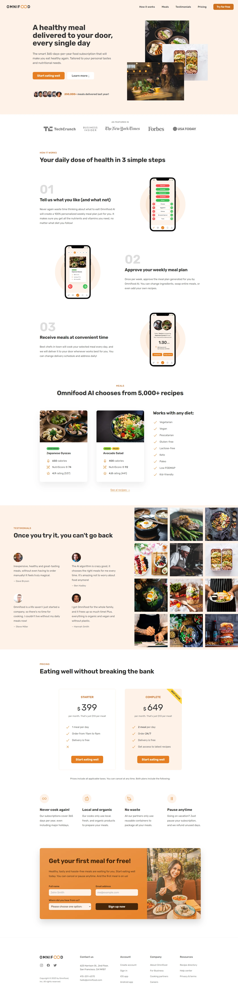

# Omnifood
Single page restaurant website. Omnifood is a fictional company focused on providing AI-based meals through a subscription service.
The website was build as part of an HTML/CSS course.

# Features

- Smooth scrolling whenever a navigation is clicked
- Hamburger menu that appears on tablet-sized screens and smaller
- Sticky header which triggers when header is out of the viewport using `IntersectionObserver`
- Cross-browser support for certain CSS styles using prefixes (e.g. `-webkit`, `-moz-`, `-o-`, `-ms-`)
- Fully responsive design
- Utilized grid, flexbox and absolute positioning

